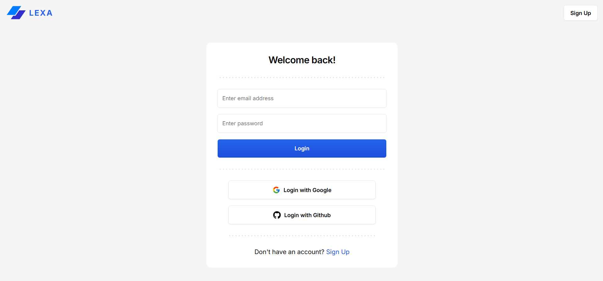
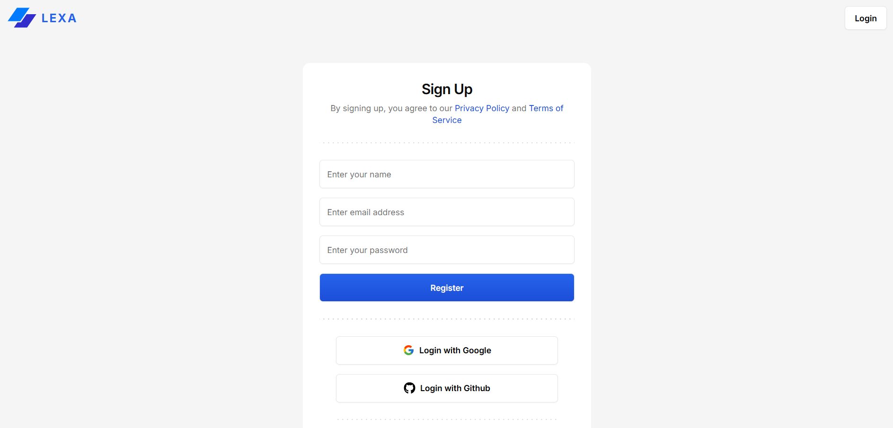
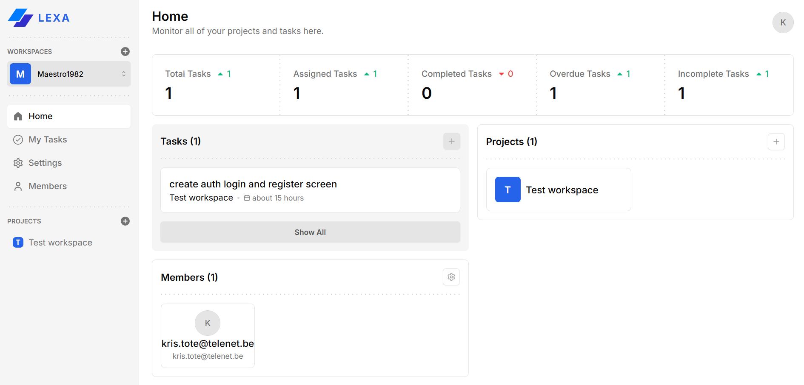
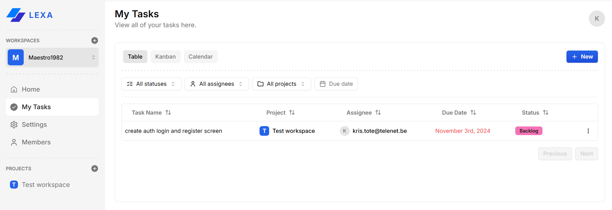
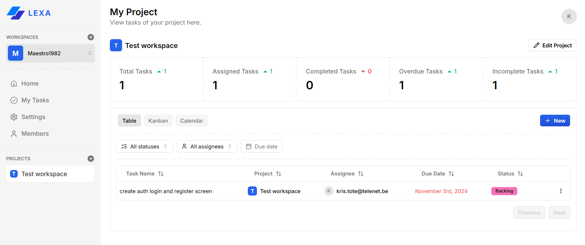
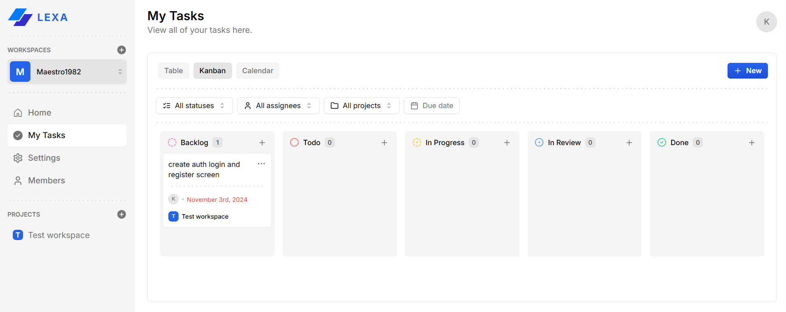
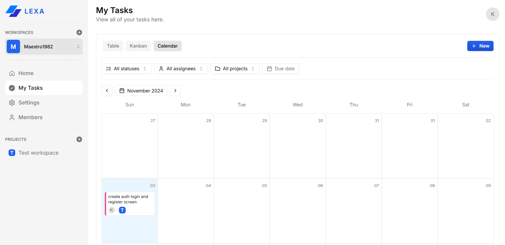
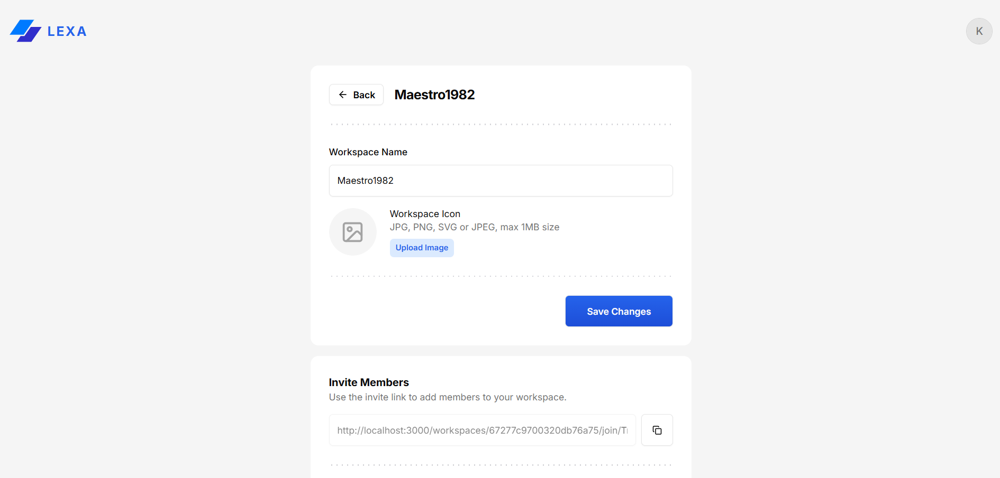
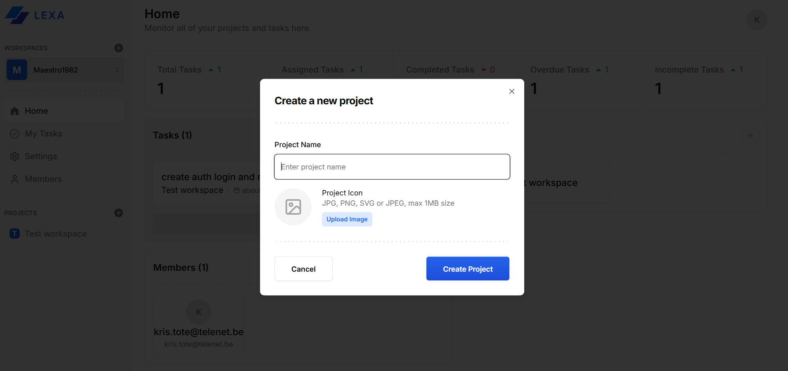
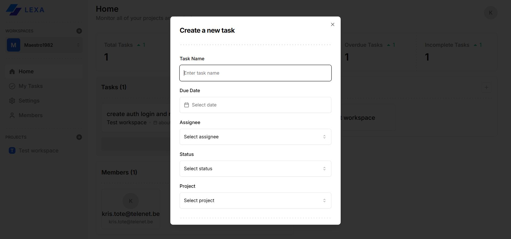

# Features

- CRUD Workspaces
- CRUD Projects
- CRUD Members
- CRUD Tasks
- Kanban Board
- Calendar
- Invite System
- Role-based Access
- Image Uploads
- Analytics
- Authentication
- And More...

# Technologies

- Next.js 14
- TypeScript
- Oauth
- Date-fns
- Tailwind CSS
- React-big-Calendar
- Hono.js
- Tanstack-react-query
- Shadcn/ui
- Zod-validation
- Nuqs
- Hello-pangea-dnd
- Node-appwrite

# App Images

